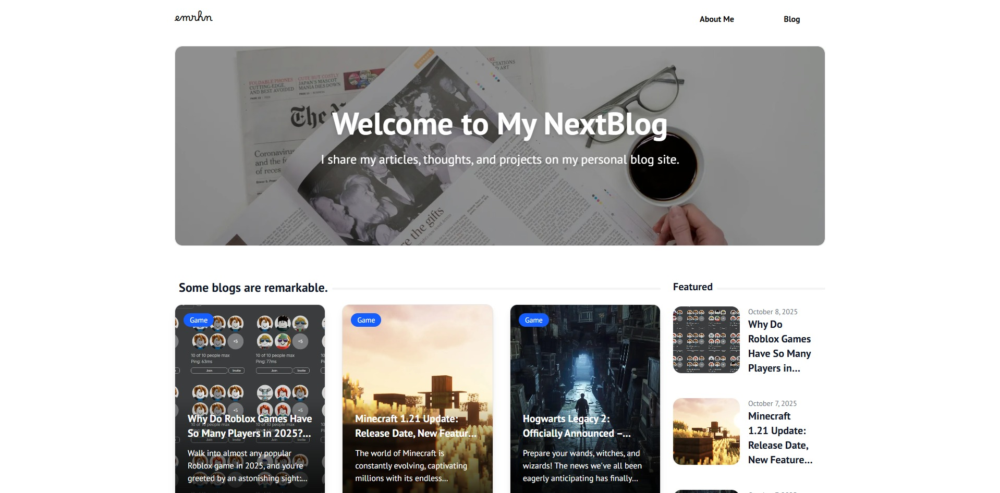
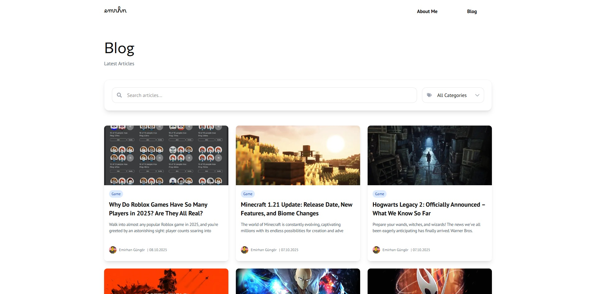
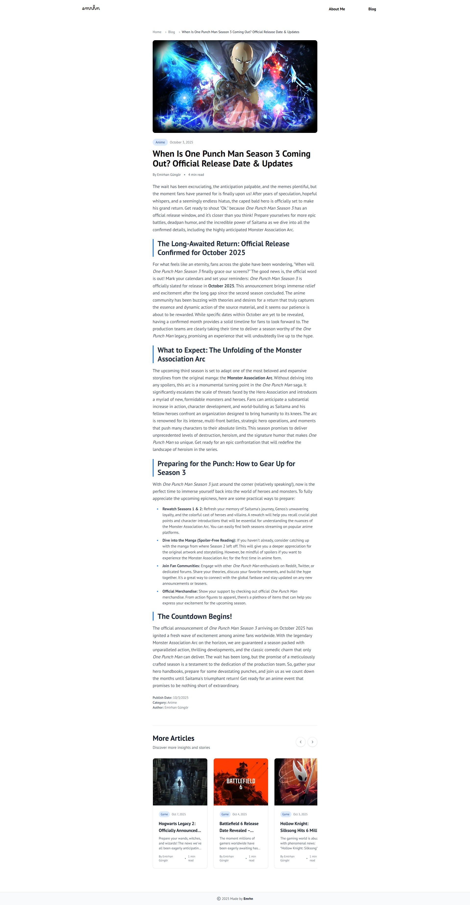
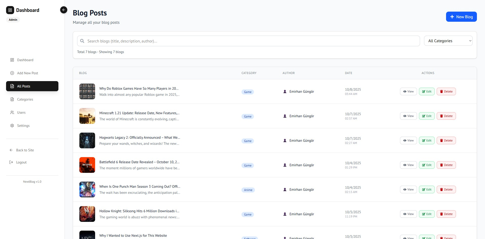
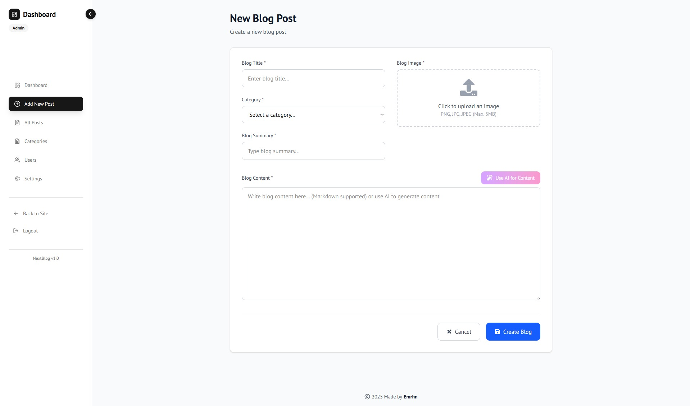
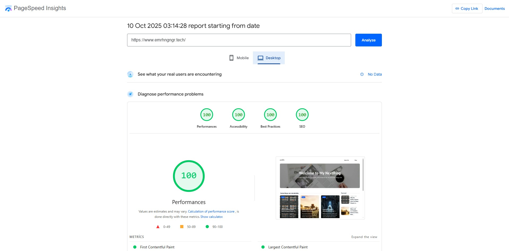

# Next.js Blog CMS

<div align="center">  
  [](https://nextjs.org/)
  [](https://www.typescriptlang.org/)
  [](https://www.mongodb.com/)
  [](https://tailwindcss.com/)
  [](https://opensource.org/licenses/MIT)
</div>

> **Note:** This project is currently on hold. The backend is mostly complete, and the frontend will be finalized soon.

A modern blog content management system built with Next.js 15, TypeScript, MongoDB, and NextAuth.js. Features an admin panel for managing blogs, categories, and **AI-Powered Content Creation** using the Gemini API.

## 🚀 Features

- **Modern Tech Stack**: Next.js 15, TypeScript, Tailwind CSS
- **Authentication**: NextAuth.js with GitHub OAuth and credentials
- **Content Management**: Full CRUD for blogs and categories
- **AI-Powered Content Creation**: Generate blog content using Gemini API by providing title, summary, and category
- **Image Upload**: Cloudinary integration for image hosting
- **Responsive Design**: Mobile-first responsive UI
- **SEO Optimized**: Meta tags, Schema.org structured data
- **Rich Text Editor**: Markdown support for blog content

## 📸 Screenshots

### 🏠 Homepage
<div align="center">
  
  <p><em>Clean and modern homepage design with featured blog posts</em></p>
</div>

### 📝 Blog Page
<div align="center">
  
  <p><em>Responsive blog listing with category filtering and search functionality</em></p>
</div>

### 📖 Blog Detail Page
<div align="center">
  
  <p><em>Rich blog post view with markdown rendering and SEO optimization</em></p>
</div>

### 🔧 Admin Dashboard
<div align="center">
  
  <p><em>Comprehensive admin panel for content management</em></p>
</div>

### ✨ AI Content Generation
<div align="center">
  
  <p><em>AI-powered content creation using Google Gemini API</em></p>
</div>

## 🚀 Performance & SEO

### ⚡ Perfect Performance & SEO Scores
<div align="center">
  
  <p><em>Perfect 100/100 scores across all PageSpeed Insights</em></p>
</div>

## 🛠️ Tech Stack

- **Frontend**: Next.js 15, React 19, TypeScript, Tailwind CSS
- **Backend**: Next.js API Routes, MongoDB, Mongoose
- **Authentication**: NextAuth.js (GitHub OAuth + Credentials)
- **Image Storage**: Cloudinary
- **AI Integration**: Google Gemini API
- **Styling**: Tailwind CSS with custom components
- **Icons**: React Icons
- **Notifications**: React Toastify

## 📋 Prerequisites

- Node.js (v18+)
- npm or yarn
- MongoDB (local or cloud)
- Cloudinary account
- GitHub OAuth app
- Google Gemini API key

## 🚀 Quick Start

1. **Clone Repository**
   ```bash
   git clone https://github.com/YOUR_USERNAME/nextblog.git
   cd nextblog
   ```

2. **Install Dependencies**
   ```bash
   npm install
   # or
   yarn install
   ```

3. **Set Up Environment Variables**
   Create a `.env.local` file:
   ```env
   MONGODB_URI=mongodb://localhost:27017/nextblog
   NEXTAUTH_URL=http://localhost:3000
   NEXTAUTH_SECRET=your-super-secret-key
   NEXTAUTH_GITHUB_ID=your-github-client-id
   NEXTAUTH_GITHUB_SECRET=your-github-client-secret
   CLOUDINARY_CLOUD_NAME=your-cloudinary-cloud-name
   CLOUDINARY_API_KEY=your-cloudinary-api-key
   CLOUDINARY_API_SECRET=your-cloudinary-api-secret
   GEMINI_API_KEY=your-gemini-api-key
   OWNER_PASSWORD=random123
   ```

4. **Database Setup**
   - **Local MongoDB**: Install and start MongoDB, use `mongodb://localhost:27017/nextblog`.
   - **MongoDB Atlas**: Create a cluster at [MongoDB Atlas](https://www.mongodb.com/atlas), get connection string, update `.env.local`.

5. **GitHub OAuth Setup**
   - Create OAuth app at [GitHub Developer Settings](https://github.com/settings/applications/new).
   - Set Homepage URL: `http://localhost:3000`, Callback URL: `http://localhost:3000/api/auth/callback/github`.
   - Add Client ID and Secret to `.env.local`.

6. **Cloudinary Setup**
   - Sign up at [Cloudinary](https://cloudinary.com).
   - Add Cloud Name, API Key, and API Secret to `.env.local`.

7. **Gemini API Setup**
   - Obtain a Gemini API key from [Google Cloud](https://cloud.google.com).
   - Add to `.env.local` as `GEMINI_API_KEY`.

8. **Run Development Server**
   ```bash
   npm run dev
   # or
   yarn dev
   ```

## 📚 Database Models

- **User**: Authentication, permissions
- **Blog**: Title, summary, content, author, category, visibility
- **Category**: Name, slug, description

## 🛠️ API Routes

- `/api/auth/*`: NextAuth authentication
- `/api/blog`: Blog CRUD operations
- `/api/categories`: Category management
- `/api/ai/generate-content`: Generate content via Gemini API (input: title, summary, category)

## 🚀 Deployment

### Vercel
1. Push code to GitHub.
2. Connect to [Vercel](https://vercel.com).
3. Add environment variables in Vercel dashboard.
4. Update `NEXTAUTH_URL` to production domain.

## 📊 Performance Metrics

<div align="center">
  
| Metric | Score | Description |
|--------|-------|-------------|
| **Performance** | 100/100 | ⚡ Optimized loading and rendering |
| **Accessibility** | 100/100 | ♿ WCAG compliance and screen reader support |
| **Best Practices** | 100/100 | 🔒 Security and modern web standards |
| **SEO** | 100/100 | 🔍 Search engine optimization |

</div>

## 🛡️ Security Features

- Environment variable validation
- Input validation and sanitization
- Secure password hashing with bcrypt
- JWT token management

## 🤝 Contributing

1. Fork the repository.
2. Create a feature branch (`git checkout -b feature/new-feature`).
3. Commit changes (`git commit -m 'Add new feature'`).
4. Push to branch (`git push origin feature/new-feature`).
5. Open a Pull Request.

## 📄 License

MIT License - see [LICENSE](LICENSE) for details.

## 👨‍💻 Author

**Emirhan Güngör**
- GitHub: [@emrhngngr](https://github.com/emrhngngr)
- LinkedIn: [Emirhan Güngör](https://linkedin.com/in/emrhn-gngr)

---

<div align="center">
  <h3>⭐ If you found this project helpful, please give it a star! ⭐</h3>
  <p><strong>Happy Blogging! 🎉</strong></p>
  <p>For support, open an issue on GitHub.</p>
</div>
